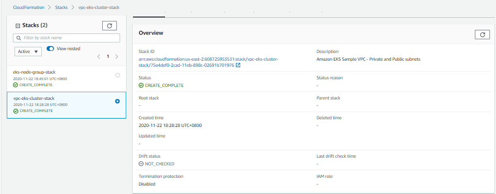
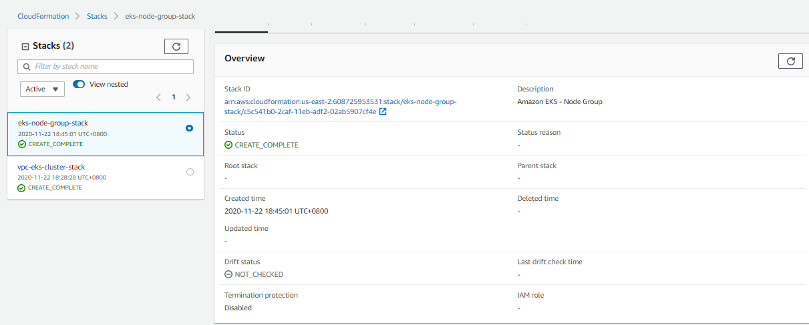
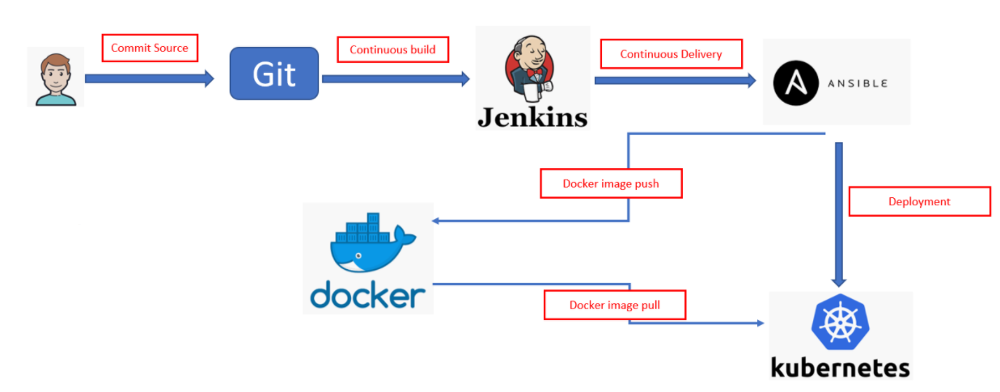
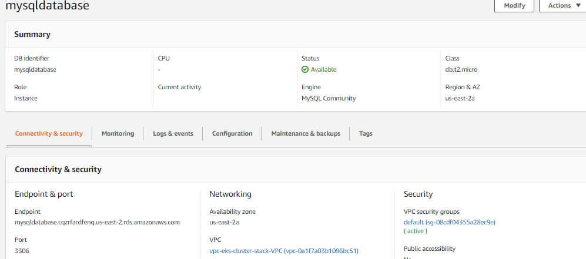
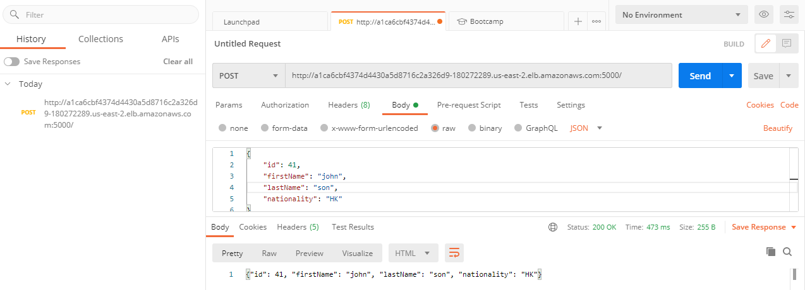
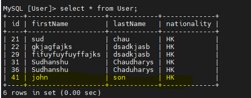
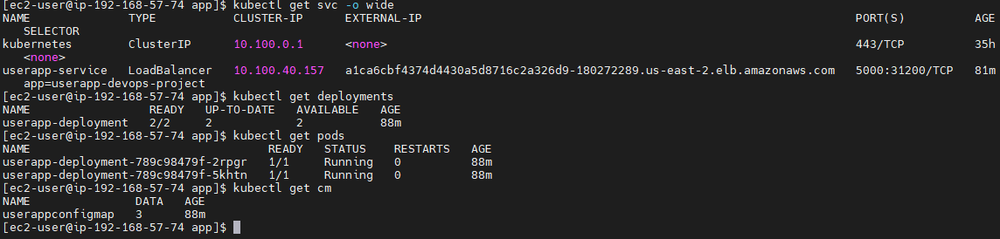
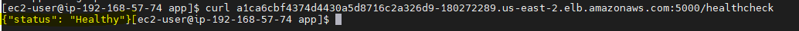
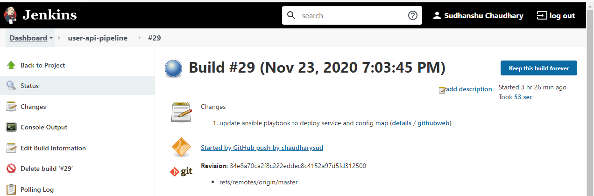
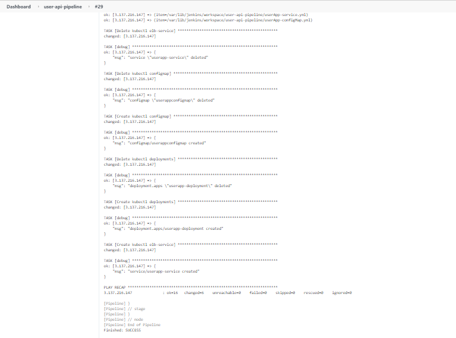

# Question-1

# Total time to setup EKS cluster and EKS nodes is around 20 mminutes

# EKS Cluster Creation

#Infrastructure as a code 


```console
Setup aws configure to run aws cloudformation 

download the code from github

git clone https://github.com/chaudharysud/user-api.git

refer : /eks-cluster-cf

i) Validate the cf yaml

aws cloudformation validate-template --template-body file://./amazon-eks-vpc-private-subnets-ekscluster.yaml  --region us-east-2

ii) run command:

eks-cluster-cf]$ aws cloudformation create-stack --stack-name vpc-eks-cluster-stack --template-body file://./amazon-eks-vpc-private-subnets-ekscluster.yaml --region us-east-2 --parameters ParameterKey=EKSClusterName,ParameterValue=ekscluster --capabilities CAPABILITY_NAMED_IAM
```
output:




# EKS worker node group Creation

#Infrastructure as a code 


```console
Setup aws configure to run aws cloudformation 

i) Validate the cf yaml

refer : ./worker-nodes-cf

aws cloudformation validate-template --template-body file://./amazon-eks-nodegroup.yaml --region us-east-2

ii) run command:

eks-cluster-cf]$ aws cloudformation create-stack --stack-name eks-node-group-stack --template-body file://./amazon-eks-nodegroup.yaml --region us-east-2 --parameters ParameterKey=ClusterControlPlaneSecurityGroup,ParameterValue=<> ParameterKey=NodeGroupName,ParameterValue=eks-node-group ParameterKey=KeyName,ParameterValue=<> 
ParameterKey=Subnets,ParameterValue=<> ParameterKey=VpcId,ParameterValue=<> ParameterKey=ClusterName,ParameterValue=<>
--capabilities CAPABILITY_NAMED_IAM


**Please take the reference of below requested parameters of VPC from EKS Cluster output

when calling the CreateStack operation: Parameters: [ClusterControlPlaneSecurityGroup, NodeGroupName, KeyName, Subnets, VpcId, ClusterName] must have values


```
output:



# Question 2

# Tools used :  Cloudformation, Jenkins(pipeline with inbuild plugins), git/github, docker/dockerhub, Ansible 

#Set up a KubeCtl server. Create a EC2 instance and execute following commands or pass as a userdata


```console

curl -o aws-iam-authenticator https://amazon-eks.s3.us-west-2.amazonaws.com/1.18.9/2020-11-02/bin/linux/amd64/aws-iam-authenticator

chmod +x ./aws-iam-authenticator

mkdir -p $HOME/bin && cp ./aws-iam-authenticator $HOME/bin/aws-iam-authenticator && export PATH=$PATH:$HOME/bin

curl -o kubectl https://amazon-eks.s3.us-west-2.amazonaws.com/1.17.12/2020-11-02/bin/linux/amd64/kubectl

chmod +x ./kubectl

mkdir -p $HOME/bin && cp ./kubectl $HOME/bin/kubectl && export PATH=$PATH:$HOME/bin

aws eks --region us-east-2 update-kubeconfig --name eks-cluster

export KUBECONFIG=~/.kube/config

```
* Details for above setup

Amazon EKS uses IAM to provide authentication to your Kubernetes cluster through the AWS IAM authenticator for Kubernetes 

# IAM Authenticator

c) Install IAM authenticator

```console

download the binary

https://docs.aws.amazon.com/eks/latest/userguide/install-aws-iam-authenticator.html

curl -o aws-iam-authenticator https://amazon-eks.s3.us-west-2.amazonaws.com/1.18.9/2020-11-02/bin/linux/amd64/aws-iam-authenticator

```

b) Apply execute permissions to the binary.

```console
chmod +x ./aws-iam-authenticator
```

c) Copy the binary to a folder in your $PATH. We recommend creating a $HOME/bin/aws-iam-authenticator and ensuring that $HOME/bin comes first in your $PATH.

```console
mkdir -p $HOME/bin && cp ./aws-iam-authenticator $HOME/bin/aws-iam-authenticator && export PATH=$PATH:$HOME/bin
```

d) check setup : aws-iam-authenticator help

```console
aws-iam-authenticator help
```
# Kubectl

a) Install Kubectl aws

```console
downlaod the binary
curl -o kubectl https://amazon-eks.s3.us-west-2.amazonaws.com/1.17.12/2020-11-02/bin/linux/amd64/kubectl
```
b) Apply execute permissions to the binary.

```console
chmod +x ./kubectl
```

c) Copy the binary to a folder in your PATH. If you have already installed a version of kubectl , then we recommend creating a $HOME/bin/kubectl and ensuring that $HOME/bin comes first in your $PATH.
```console
mkdir -p $HOME/bin && cp ./kubectl $HOME/bin/kubectl && export PATH=$PATH:$HOME/bin
```

d) check Kubectl :  kubectl version --short --client
```console
kubectl version --short --client
```

e) update kubectl config file for eks cluster demo is cluster name
```console
aws eks --region us-east-2 update-kubeconfig --name eks-cluster
```
f) Register the worker node with EKS cluster

```console
download the file from amazone

curl -o aws-auth-cm.yaml https://amazon-eks.s3-us-west-2.amazonaws.com/cloudformation/2019-02-11/aws-auth-cm.yaml

update the node instance role which is created after executed the worker node group  cloud formation in aws-auth-cm.yaml and run below command

kubectl apply -f aws-auth-cm.yaml
```

# create a kubernetes load blancer (Can be automated from Jenkins one time activity)
1) From Kubectl server execute following command

```console
#To create loadblancer

~/app/create-userapi-service.sh

#To delete load balance
~/app/delete-userapi-service.sh

```

# Setup Build Server

a) Setup a Build server and pass following scripts in user data
```console
sudo wget -O /etc/yum.repos.d/jenkins.repo http://pkg.jenkins.io/redhat/jenkins.repo
sudo rpm --import http://pkg.jenkins.io/redhat/jenkins.io.key
sudo yum install java-1.8.0-openjdk  java-1.8.0-openjdk-devel git docker python3 jenkins –y
sudo amazon-linux-extras install ansible2 -y
```
b) validate the version of installed package

c) Start the docker
    * Add user in docker deamon
        * sudo groupadd docker
        * sudo usermod -aG docker ${USER}
        * logout and log in again to reflect the changes.
  ```console
  sudo service docker start
  sudo usermod -aG docker jenkins ${USER}
  
 d) start Jenkins
 ``` console
 sudo service jenkins start 
 ```
 e) Once Jenkins is up and running enable security group to access port 8080
 
 f) update the required jenkins plugins for git/docker and ansible
 
 # Define the jenkins pipeline

```console
node {
    def app

    stage('Clone sources') {
        print "Workspace: ${WORKSPACE}"
        git credentialsId: 'git', url: 'https://github.com/chaudharysud/user-api.git'
    }

    stage('Build image') {
        /* This builds the actual image */

        app = docker.build("chaudharys/hubint")
    }

    stage('Test image') {
        
        app.inside {
            echo "Tests passed"
        }
    }

    stage('Push image') {
        /* 
			You would need to first register with DockerHub before you can push images to your account
		*/
        docker.withRegistry('https://registry.hub.docker.com', 'dockerhub') {
            app.push("${env.BUILD_NUMBER}")
            app.push("latest")
            } 
                echo "Trying to Push Docker Build to DockerHub"
    }
    
    
    stage('run ansible playbook') {
        ansiblePlaybook credentialsId: 'kubectl', disableHostKeyChecking: true, installation: 'ansible2', inventory: 'kubectl.inv', playbook: 'kubectl-playbook.yml'
    }
    
    
    
}
```

# Committed file for Deployent

| File                | description                |
| -------------       | -------------              |
| userApp-deploy.yml  | Deployment menifiest file  |
| userApp-service.yml | service is defines to listern the request on 5000              |  
| userApp-configMap.yml | used to keep the environment varibale like DBHOST, DBUSER and DBPASSWD (secrets can be used )             |  
| kubectl-playbook.yml | Ansible play book to deploy the code on kubernetes master               |  
| kubectl.inv | Anisble inventory file , IP address of kubectl server needs to be updated here              |  
| delete-userapi-service.sh | delete the kubectl service              |  
| delete-userapi-deployment.sh | delete the kubectl deployment and pods              |  
| create-userapi-service.sh | create the kubectl service             |  
| create-userapi-deployment.sh | create the kubectl deploment             |
| worker-nodes-cf/ | clodforation stack to genrate the eks worker nodes : these are amazon provided standard tempalte            |
| eks-cluster-cf/ | clodformation stack to generate the eks cluster : these are amazon provided standard tempalte           |
 
# Pipeline work flow


  
#One time DB creation using RDS (SQL)



# Smoke Test

#Postman request






#Kubernets resource status



#user-api-healthchecks



#JekinsBuild state



#Jenkins jobs logs




 


